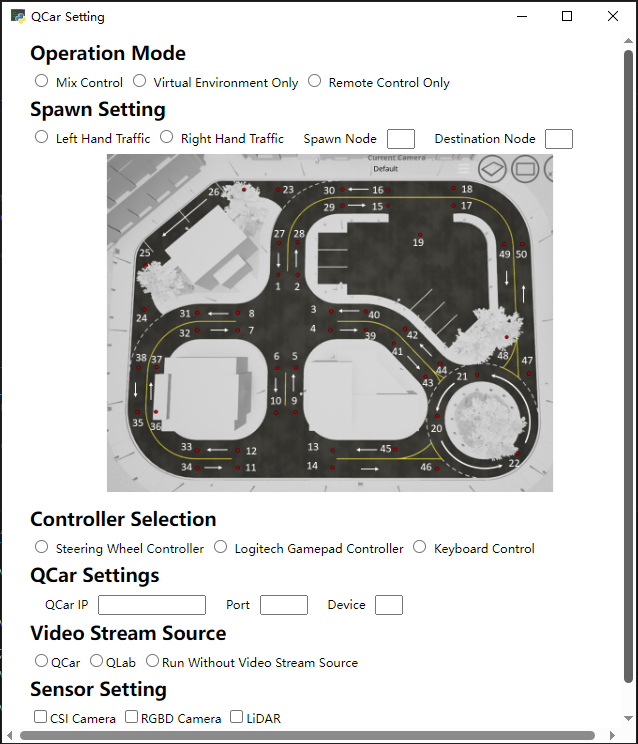
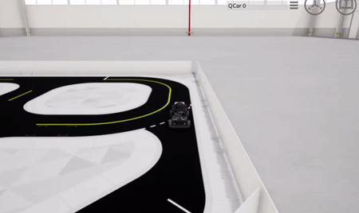

# QEnv
## Introduction
This Python-based project is designed as an extension to the capabilities of the original QCarSteeringControl project. It focuses on enabling remote control of Quanser Devices and control within the QLab environment. While it builds upon the ideas of the original project, it operates independently and is not backward compatible.

## Supported Devices
### Logitech
This project was tested with the Logitech G920 Driving Force Racing Wheel controller, but according to Logitech document, it should also work with the following devices:
- G29
- G920
- Driving Force GT
- G27
- G25
- Driving Force
- Formula Force GP
- Formula Force
### Quanser
- Quanser QCar

## Installation
To install and run this project, you need to have some packages, QLab and Logitech G Hub installed on your workstation.
- third party requirements: `pip install -r requirements.txt`
- Logitech G Hub: https://www.logitechg.com/en-ca/innovation/g-hub.html
- quanser package and QLab are provided by Quanser

## Project Preview
### QCar Setting

### Control QCar by Script

### Spawn QCar on a Random Position of the Route

## License
This project is licensed under the Apache-2.0 license - see the LICENSE file for details.
